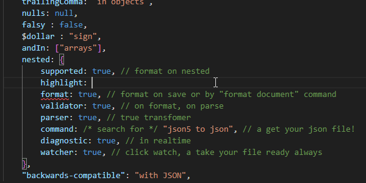
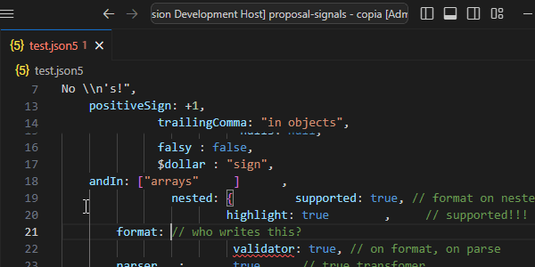
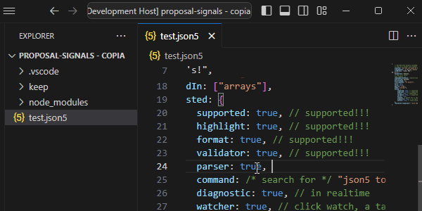
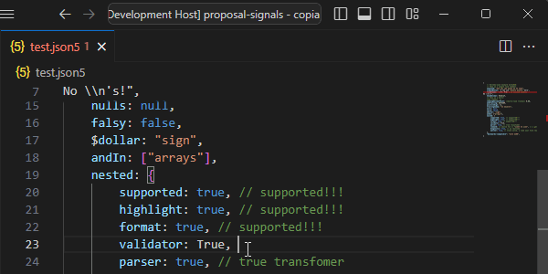
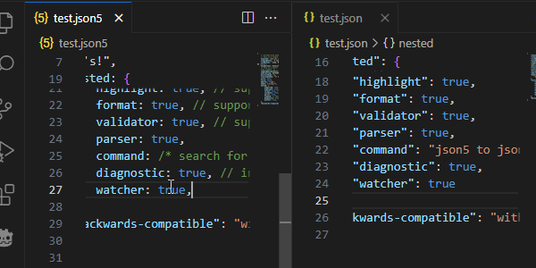

# JSON5 KIT

A powerful JSON5 plugin for VSCode that enhances your JSON5 editing experience with syntax highlighting, formatting, parsing, commands, validation, diagnostics, and watcher.

## Features

### 🌈 Syntax Highlighting
Enjoy advanced syntax highlighting for JSON5 files, including support for strings, numbers, booleans, and comments. (and a nice icon {5} )

### ✨ Formatter
Automatically format your JSON5 files with configurable options to keep your code clean and consistent.

### 🔍 Parser
Built-in JSON5 parser to ensure your files are correctly interpreted.

### ⚙️ Commands
Convert JSON5 to JSON easily with the `json5 to json` command.

### 🛠️ Validator
Catch syntax errors early with real-time validation as you type.

### 🚨 Diagnostics
Receive detailed error diagnostics directly in your editor, helping you quickly identify and fix issues.

### 👀 Watcher
Automatically convert JSON5 files to JSON upon saving with the built-in watcher. Easily toggle the watcher from the status bar.

## Installation

1. Open VSCode.
2. Go to the Extensions view by clicking on the Extensions icon in the Sidebar.
3. Search for "JSON5 VSCode Plugin" by savh and click Install.

## Usage

Open any `.json5` file, and the plugin will automatically activate. Use the Command Palette (Ctrl+Shift+P) to access commands like `json5 to json`, `Format Document` or use the button `Watch JSON5`

#

### About Me

I’m a versatile digital creator, offering a range of services from data entry to web development, illustration, and custom projects **on request**. Every task I take on is done with love and dedication, driven by a passion for helping others and making the digital world a better place. Your support fuels my creativity and empowers me to continue doing what I love. Together, we can create something amazing.

